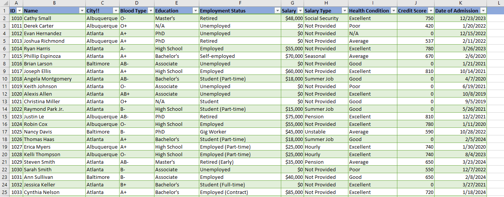

# GreenData-Solutions_Data_Cleaning_Challenge_Report.
I am **Tijani Taiwo Akanni**, a participant of the 10 days data cleaning challenge organized by GreenData Solutions. The main aim of this project is to showcase my first docunmentation using Github with
the data cleaning challenge I partcipated some months ago.

## Project Description: 
This Data cleaning project aimed to analyze and clean messy data related to patient’s health records. This involves identifying and addressing inconsistencies, missing values, and formatting errors.

## Dataset Information:
- Dataset Name: HealthCare Dataset  
- Source: GreenData Solutions  
- Size: 1659 Rows, 12 Columns  
- Format: CSV

## Dataset Descriptions:
###  Duplicates Data
- There exist 3 duplicate records in the datasets
- The ID column also contains duplicate records.

### Incomplete Data:
- Missing data in Gender, City, Education, Blood Type, Salary, and Health_condition.

### Inconsistent Data:
- Inconsistent Capitalization in Name and City.
- Data inconsistence in Gender, City, Education, and Health_Condition: Male and Female written as M and F.  Atlanta, Baltimore and Albuquerque written as Alt, Balti, and Albuque respectively. Bachelor’s written as Bachelor and Excellent written as Excellent(?!)
- Data Type mismatch error in Salary and Credit_Score
- Unstandardized Date format.

### Inaccurate/Incorrect Data
- Age equals Zero, and a PhD holders having age less than 10......
- Also, Salary having negative values.

## The image below show the Exploratory Data analysis performed on the datasets to understand the dataset structure, identify anomalies, and gain preliminary insights.

