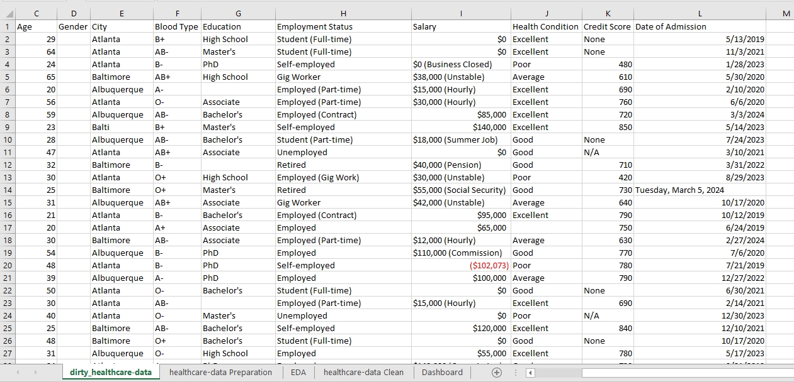
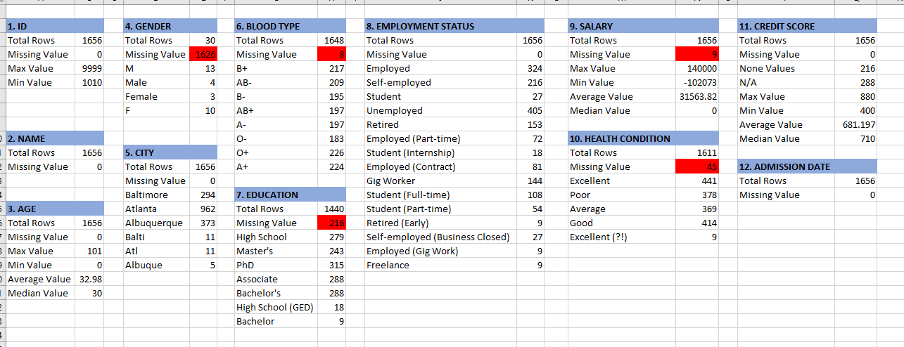
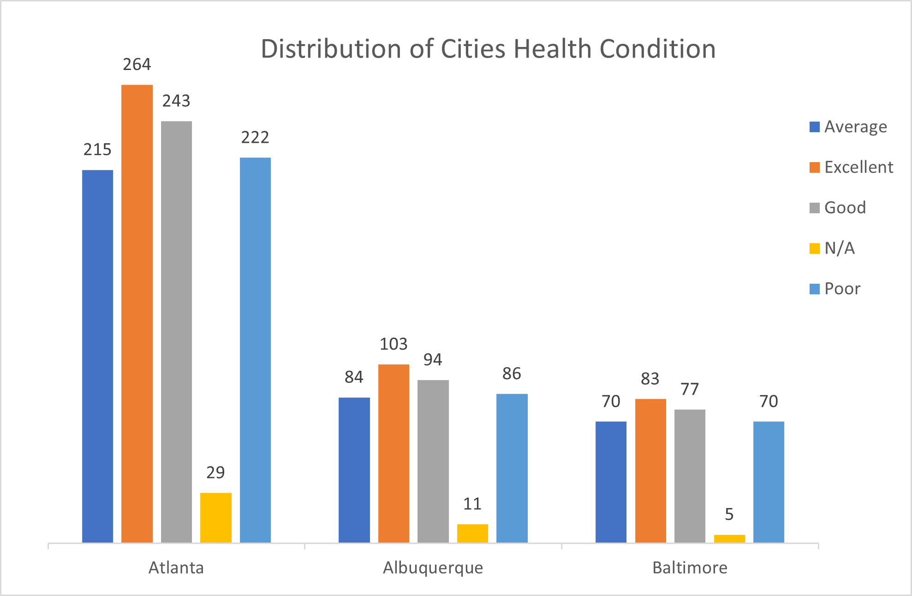
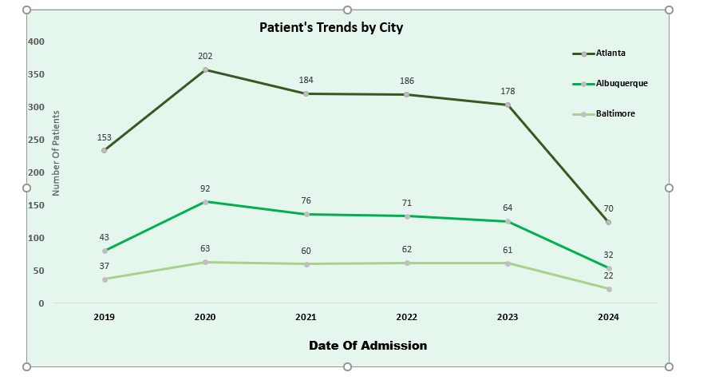

# GreenData-Solutions_Data_Cleaning_Challenge_Report.
I am **Tijani Taiwo Akanni**, a participant of the 10 days data cleaning challenge organized by GreenData Solutions. The main aim of this project is to showcase my first docunmentation using Github with
the data cleaning challenge I partcipated some months ago.

## Project Description: 
This Data cleaning project aimed to analyze and clean messy data related to patient’s health records. This involves identifying and addressing inconsistencies, missing values, and formatting errors.

## Dataset Information:
- Dataset Name: HealthCare Dataset  
- Source: GreenData Solutions  
- Size: 1659 Rows, 12 Columns  
- Format: CSV
###### The image below show the raw dataset before transformation

## Dataset Descriptions:
###  Duplicates Data
- There exist 3 duplicate records in the datasets
- The ID column also contains duplicate records.

### Incomplete Data:
- Missing data in Gender, City, Education, Blood Type, Salary, and Health_condition.

### Inconsistent Data:
- Inconsistent Capitalization in Name and City.
- Data inconsistence in Gender, City, Education, and Health_Condition: Male and Female written as M and F.  Atlanta, Baltimore and Albuquerque written as Alt, Balti, and Albuque respectively. Bachelor’s written as Bachelor and Excellent written as Excellent(?!)
- Data Type mismatch error in Salary and Credit_Score
- Unstandardized Date format.

### Inaccurate/Incorrect Data
- Age equals Zero, and a PhD holders having age less than 10......
- Also, Salary having negative values.

###### The image below show the Exploratory Data analysis performed on the datasets to understand the dataset structure, identify anomalies, and gain preliminary insights.

## Data Cleaning Process:
- A copy of the original data was created before transformation to avoid data lost.
- Adjust the size of the columns to view the records on each columns very well
- Adjust the columns header by applying bold text and adding cell color, this is to differentiate each column header and their records.
- **ID Column:** New unique ID column was created to deals with the duplicate data in the initial ID. This is because the ID was assumed to be a unique identifier assigned to each individual or record.
- **Name Column:** "Proper" Function was used to capitalize the Name records
- **Age Column:** Removed Age field because of  data inaccuracy: Age equals Zero, and a PhD holders having age less than 10......,,
- **Gender Column:** Removed Gender field because it has 98.2% missing data
- C**ity Column:** Formula/Function used **_=PROPER(IFNA(IFS(E2="Atl","Atlanta",E2="Balti","Baltimore",E2="Albuque","Albuquerque"),E2)) ”_**

  - IFS function was used to change Atl, Balti, and Albuque to Atlanta, Baltimore and Albuquerque respectively.  
  - IFNA was used to return the original value(E2) if E2 is not Atl, Balti, or Albuque.  
  - PROPER was used to capitalize the City field.
  - The E2 used is for CELL REFERENCING purpose.
    
- **Blood Type Column:** formula/function used **_"=IF(G2="","N/A",G2) “_**
  - IF function is used to replace the missing value in Blood_type field to N/A( not available).

- **Education field:**
    **_=IFNA(IFS(I2="Bachelor","Bachelor's",I2="","N/A"),I2)_**
    - IFS function to replace Bachelor to Bachelor’s and Null to N/A
·   - IFNA to return the original value if Bachelor or “ “(empty) is not available

- **Salary Column:** Text to Column was used to separate the initial Salary field that contains Salary and Salary types: “$100,000 (Seasonal)” using Space delimiter.
  This resulted to two fields, “Salary and Salary types”. The salary type with no salary type was replaced with “Not provided” using Find & Replace features in Excel.
 
     - 9 Rows with “Missing” value was replaced with $0 because they are identified as “Unemployed”.
     - To deal with negative salaries, using filter feature to check the negative salary rows, it’s discovered that it consisted PhD holders and either Self employed or employed employment status. This was resolved with the following formula/function:
      **”_{=IFNA(IFS(AND(M8<0,I8="PhD",K8="Self-employed"),120000,AND(M8<0,I8="PhD",K8="Employed"),AVERAGE(90000,100000,120000)),M8) _“**
       
       - _AND(M8<0,I8="PhD",K8="Employed")_ was used to check for, negative salary rows with PhD Education and Employed employment status.
       - IFS function was used to assigned 120000 to rows that are TRUE for the first condition mentioned above because 120000 is the only Salary for other PhD holders with Self employed status, and the average of  (90000,100000,120000) was used for the second condition because those are the three values available salary.
       - IFNA was used to adjust the rows to return original value if the two conditions are not available

- **Health Condition field:** The data inconsistent was controlled using
**_=IFNA(IFS(P9="Excellent (?!)","Excellent",P9="","N/A"),P9)_**
  
   *  IFS function to change records with Excellent (?!) to Excellent, and Null values to N/A.
  * IFNA was used to adjust the rows to return original value if the two conditions are not available

- **Credit Score Field:** Text to column was used to separate the field into two, this separated values like 380 (Typo) to 380 and (Typo), the second field created from Text to column feature was removed and “N/A and None” values in the first column created was replaced with zero because they are identified as student and unemployed education status that have zero salary with no credit worthiness.

- **Date of Admission:** Text to columns and Date function was employed to standardized the date format. The date format was in "short date".

##### Dataset after cleaning

## Short analysis: 
Identify cities or demographics with higher healthcare needs based on health conditions and admission dates.

###### Visuals to show distribution of City base on Health condition and patients trends in each city from 2019 to 2024.
    Distribution of cities Health condition                | Patients trend by cities
: ------------------------------------------------------: | :------------------------------------------:
 | 

### Analysis Insight:
- Atlanta has the highest number of patients for each year from 2019 to 2024
- All city have their highest number of patients in the year 2020( The covid year)
- Baltimore has the highest decline rate of 64% from 2023 to 2024, followed by Atlanta 61%.

### Conclusion: 
Atlanta city should be provided with more healthcare need as the analysis showed that they have higher number of patients admitted for every year from 2019 to 2024.
